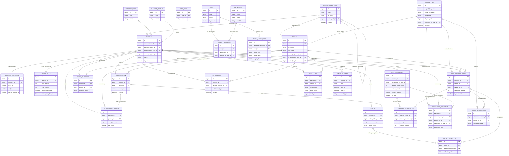

# Pełny diagram ERD (modele domenowe)

```mermaid
erDiagram
  ORGANIZATIONAL_UNIT {
    bigint id PK
    string name
    string unit_type
    bigint parent_unit_id FK
    boolean is_active
  }
  STORED_FILE {
    bigint id PK
    string original_file_name
    string stored_file_name
    string mime_type
    bigint file_size_bytes
    bigint uploaded_by_user_id FK
    boolean is_public
  }
  PERSON {
    bigint id PK
    bigint user_id FK
    string first_name
    string last_name
    string student_or_employee_no
    bigint organizational_unit_id FK
    bigint avatar_file_id FK
  }
  USER_ROLE {
    bigint id PK
    bigint user_id FK
    string role
  }
  ROLE {
    bigint id PK
    string code
    string name
    boolean is_system
  }
  PERMISSION {
    bigint id PK
    string code
    string name
    string module
  }
  ROLE_PERMISSION {
    bigint id PK
    bigint role_id FK
    bigint permission_id FK
    bigint granted_by_user_id FK
  }
  ADMIN_ACTION_LOG {
    bigint id PK
    bigint performed_by_user_id FK
    bigint role_id FK
    string action_type
    string target_table
    bigint target_id
  }
  ELECTION_TYPE {
    bigint id PK
    string code
    string name
  }
  ELECTION_STATUS {
    bigint id PK
    string code
    string name
  }
  ELECTION {
    bigint id PK
    bigint election_type_id FK
    bigint election_status_id FK
    bigint organizational_unit_id FK
    bigint created_by_user_id FK
    string name
    boolean is_secret
  }
  ELECTION_SCHEDULE {
    bigint id PK
    bigint election_id FK
    datetime start_at
    datetime end_at
    datetime results_publish_at
  }
  VOTING_RULE {
    bigint id PK
    bigint election_id FK
    int min_choices
    int max_choices
    boolean allow_blank_vote
    boolean allow_vote_change
  }
  ELECTION_CANDIDATE {
    bigint id PK
    bigint election_id FK
    bigint person_id FK
    bigint avatar_file_id FK
    int candidate_number
    boolean is_approved
  }
  VOTING_ELIGIBILITY {
    bigint id PK
    bigint election_id FK
    bigint person_id FK
    string eligibility_status
  }
  VOTING_TOKEN {
    bigint id PK
    bigint election_id FK
    bigint person_id FK
    string token_value
    boolean is_used
  }
  VOTING_PARTICIPATION {
    bigint id PK
    bigint election_id FK
    bigint person_id FK
    bigint voting_token_id FK
    boolean has_voted
  }
  BALLOT {
    bigint id PK
    bigint election_id FK
    bigint voting_token_id FK
    string anonymous_key
    string ballot_status
  }
  BALLOT_SELECTION {
    bigint id PK
    bigint ballot_id FK
    bigint election_candidate_id FK
    int selection_order
  }
  ELECTION_RESULT {
    bigint id PK
    bigint election_id FK
    bigint generated_by_user_id FK
    int eligible_voters_count
    int voters_count
    decimal turnout_percent
    boolean is_final
  }
  ELECTION_RESULT_ITEM {
    bigint id PK
    bigint election_result_id FK
    bigint election_candidate_id FK
    int votes_count
    int ranking_position
  }
  GENERATED_DOCUMENT {
    bigint id PK
    bigint election_id FK
    bigint election_result_id FK
    bigint stored_file_id FK
    bigint generated_by_user_id FK
    string document_type
  }
  CANDIDATE_ATTACHMENT {
    bigint id PK
    bigint election_candidate_id FK
    bigint stored_file_id FK
    string attachment_type
  }
  NOTIFICATION {
    bigint id PK
    bigint election_id FK
    bigint recipient_person_id FK
    string notification_type
    boolean is_sent
  }
  AUDIT_LOG {
    bigint id PK
    bigint election_id FK
    bigint person_id FK
    string action_type
    string entity_name
    bigint entity_id
  }
  ELECTION_EVENT {
    bigint id PK
    bigint election_id FK
    string title
    datetime start_at
    datetime end_at
    string event_type
  }

  ORGANIZATIONAL_UNIT ||--o{ ORGANIZATIONAL_UNIT : "nadrzedna_jednostka"
  ORGANIZATIONAL_UNIT ||--o{ PERSON : "przynaleznosc"
  ORGANIZATIONAL_UNIT ||--o{ ELECTION : "organizuje"

  STORED_FILE ||--o{ PERSON : "avatar_osoby"
  STORED_FILE ||--o{ ELECTION_CANDIDATE : "avatar_kandydata"
  STORED_FILE ||--o{ GENERATED_DOCUMENT : "plik_dokumentu"
  STORED_FILE ||--o{ CANDIDATE_ATTACHMENT : "zalacznik"

  ROLE ||--o{ ROLE_PERMISSION : "ma_uprawnienia"
  PERMISSION ||--o{ ROLE_PERMISSION : "nalezy_do_roli"
  ROLE ||--o{ ADMIN_ACTION_LOG : "kontekst_roli"

  ELECTION_TYPE ||--o{ ELECTION : "typ"
  ELECTION_STATUS ||--o{ ELECTION : "status"
  ELECTION ||--|| ELECTION_SCHEDULE : "harmonogram"
  ELECTION ||--|| VOTING_RULE : "reguly_glosowania"
  ELECTION ||--o{ ELECTION_CANDIDATE : "kandydaci"
  ELECTION ||--o{ VOTING_ELIGIBILITY : "uprawnienia"
  ELECTION ||--o{ VOTING_TOKEN : "tokeny"
  ELECTION ||--o{ VOTING_PARTICIPATION : "udzial"
  ELECTION ||--o{ BALLOT : "glosy"
  ELECTION ||--|| ELECTION_RESULT : "wynik"
  ELECTION ||--o{ GENERATED_DOCUMENT : "dokumenty"
  ELECTION ||--o{ NOTIFICATION : "powiadomienia"
  ELECTION ||--o{ AUDIT_LOG : "audyt"
  ELECTION ||--o{ ELECTION_EVENT : "wydarzenia"

  PERSON ||--o{ ELECTION_CANDIDATE : "kandyduje"
  PERSON ||--o{ VOTING_ELIGIBILITY : "ma_uprawnienie"
  PERSON ||--o{ VOTING_TOKEN : "otrzymuje_token"
  PERSON ||--o{ VOTING_PARTICIPATION : "uczestniczy"
  PERSON ||--o{ NOTIFICATION : "odbiera"
  PERSON ||--o{ AUDIT_LOG : "aktor"

  VOTING_TOKEN ||--|| VOTING_PARTICIPATION : "jedno_uczestnictwo"
  VOTING_TOKEN ||--|| BALLOT : "jeden_glos"
  BALLOT ||--o{ BALLOT_SELECTION : "wybor_kandydatow"
  ELECTION_CANDIDATE ||--o{ BALLOT_SELECTION : "jest_wybrany"
  ELECTION_RESULT ||--o{ ELECTION_RESULT_ITEM : "pozycje_wyniku"
  ELECTION_CANDIDATE ||--o{ ELECTION_RESULT_ITEM : "pozycja_kandydata"
  ELECTION_RESULT ||--o{ GENERATED_DOCUMENT : "zrodlo_dokumentu"
  ELECTION_CANDIDATE ||--o{ CANDIDATE_ATTACHMENT : "pliki_kandydata"
```
